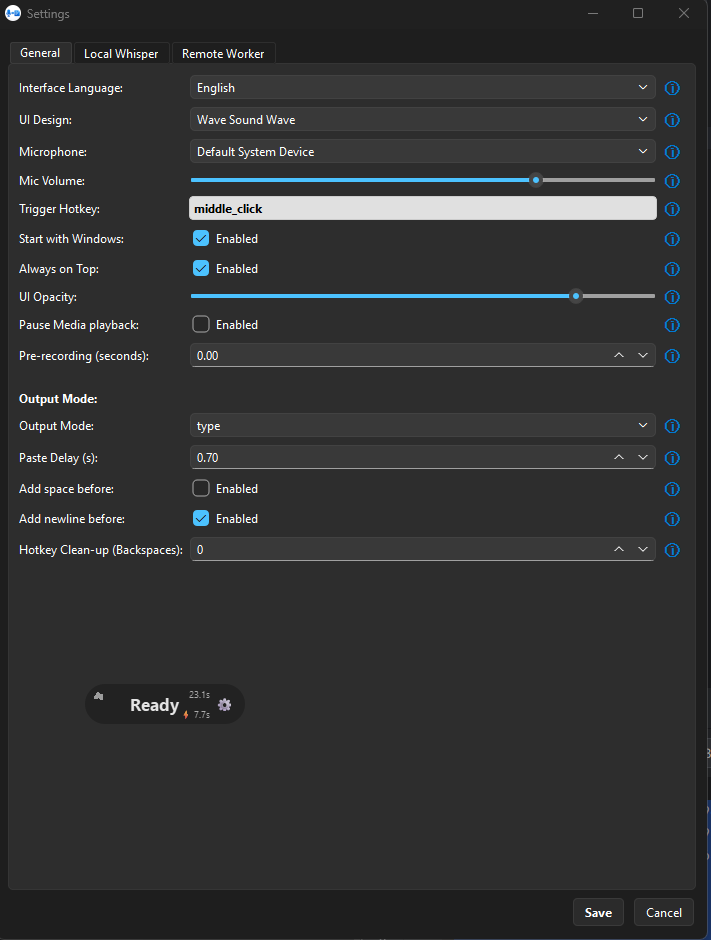
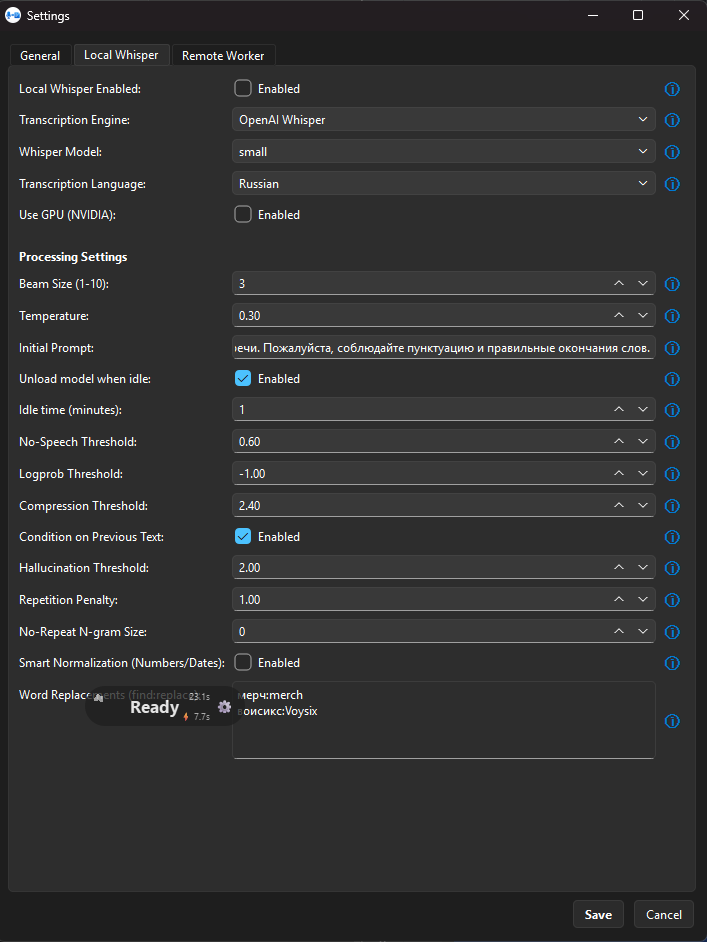
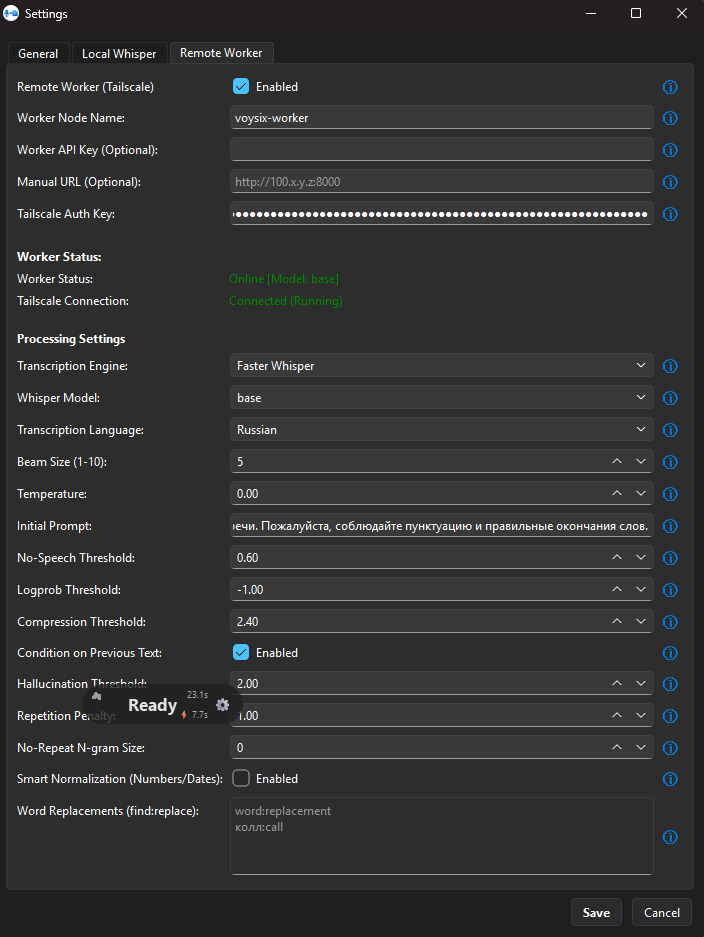
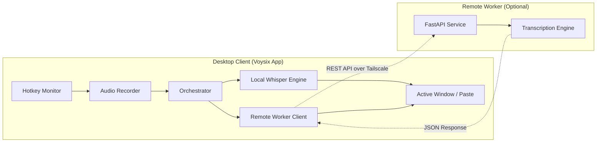
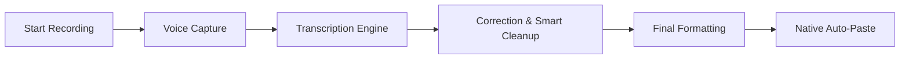

# Voysix — Professional Speech-to-Text for Desktop

[](https://github.com/your-username/voysix/actions)


**Voysix** is an open-source, versatile desktop application that brings the power of **OpenAI's Whisper** (and `faster-whisper`) directly into your daily workflow. Record your ideas, messages, or notes with a single hotkey and have them transcribed and pasted instantly into any application.

---

## ✨ Why Voysix?

- 🚀 **Global Hotkeys**: Control everything from anywhere in Windows with a single click.
- 🎨 **Glassmorphism UI**: A minimalist, high-quality floating interface that stays out of your way.
- 🛠️ **Local or Remote**: Use your own GPU locally OR offload processing to a dedicated worker.
- 💨 **Ultra-Fast**: Optimized for speed with `faster-whisper` and optional worker caching.
- 🔒 **Private**: No third-party APIs required. Your voice data stays on your machine or your private worker nodes.
- 🔗 **Tailscale Native**: Easy, secure remote worker setup with built-in Tailscale discovery.

---

## 📸 Interface Preview

<p align="center">
  
  
  
</p>

---

## 🏗️ Architecture & Core Components

Voysix is split into two independent parts, allowing for flexible deployment scenarios:



### 1. Voysix App (`/App`)
Built with **PySide6**, this component handles the recording logic and system-wide integration. It includes features like:
- **Audio Recorder**: Low-latency capture via `sounddevice`.
- **System Tray**: Comprehensive settings management and log viewer.
- **Auto-Paste**: Seamless text insertion into any target app.
- **Smart Cleanup**: Sophisticated punctuation and cleanup logic.

### 2. Voysix Worker (`/worker`)
A high-performance **FastAPI** backend for offloading computations.
- Optimized for **Docker** and **NVIDIA GPUs**.
- **Tailscale Native**: Secure remote access without port forwarding or public IPs.
- Model caching to avoid reloading overhead.

---

## 🔗 Tailscale: Secure Remote Processing

Tailscale is a zero-config mesh VPN that creates a secure, private network between your devices. Voysix uses it to tunnel audio data from your desktop to your remote GPU worker anywhere in the world.

### Why use Tailscale with Voysix?
- 🔒 **End-to-End Encryption**: Your voice data never touches the public internet unencrypted.
- 🚀 **Zero Configuration**: No port forwarding, no static IPs, and no complex firewall rules.
- 🌍 **Work From Anywhere**: Use your home GPU server from your laptop at a coffee shop or office.
- 🛠️ **Seamless Integration**: The Voysix App automatically discovers workers on your Tailnet.

### How to Connect a Remote Worker
1.  **Generate Auth Key**: Go to your [Tailscale Admin Console](https://login.tailscale.com/admin/settings/keys) and generate a **Reusable Auth Key**.
2.  **Launch Worker**: Start the worker Docker container with the `TS_AUTHKEY` environment variable (see examples below).
3.  **Setup Client**: 
    - In Voysix App settings, go to **Remote Worker**.
    - If Tailscale isn't installed, click **Download Tailscale** (the app handles the installation).
    - Log in to Tailscale using the **same account** you used for the worker.
4.  **Profit**: Once both are on the same Tailnet, simply enter the worker's Tailscale IP or hostname in the App settings.

---

## 🔄 Core Workflow



---

## 🚀 Getting Started

### Installation (Standard User)
If you just want to use Voysix, wait for the first release or follow the build steps below to create your own `.exe`.

### Installation (Developer)

1. **Clone the Repo**:
   ```bash
   git clone https://github.com/your-username/voysix.git
   cd voysix
   ```
2. **Setup Client**:
   ```bash
   cd App
   python -m venv venv
   source venv/Scripts/activate
   pip install -r requirements.txt
   python main.py
   ```
3. **Setup Worker (Optional)**:
   ```bash
   cd worker
   # Option A: Build and run locally
   docker build -t voysix-worker .
   docker run -d --name voysix-worker --restart unless-stopped -e TS_AUTHKEY=<your-key> voysix-worker

   # Option B: Pull from Docker Hub (Simplified)
   # docker pull your-username/voysix-worker:latest
   # docker run -d --name voysix-worker -e TS_AUTHKEY=<your-key> your-username/voysix-worker

#### ⚙️ Worker Configuration (Environment Variables)

Pass these to the container using `-e KEY=VALUE`. 

| Variable | Requirement | Description | Default |
| :--- | :--- | :--- | :--- |
| `TS_AUTHKEY` | **Required** | Your Tailscale Auth Key to join the private network. Generate it in Tailscale Settings. | - |
| `API_KEY` | Optional | Shared secret between the app and worker. Must match the "Worker API Key" in the app settings. | - |
| `MODEL_NAME` | Optional | The Whisper model to load on startup (tiny, base, small, medium, large, distil-large-v3). | `base` |
| `GPU_ENABLED` | Optional | Set to `1` to enable NVIDIA GPU support. This triggers automatic download of CUDA libraries (~3GB). | `0` |
| `TS_HOSTNAME` | Optional | The hostname visible in your Tailscale admin panel. | `voysix-worker` |

#### 🏃 Running the Worker

> [!IMPORTANT]
> **Persistent Data**: We highly recommend mounting this volume to keep the worker's identity and AI models between restarts:
> - `-v voysix_data:/data` — **Mandatory for stability**: Stores both Tailscale identity and downloaded AI models. This prevents creating duplicate nodes and re-downloading large files (~3GB) on every restart.

**1. Minimal Run (CPU-only)**
Use this for stable, general-purpose transcription.
```bash
docker run -d --name voysix-worker \
  --restart unless-stopped \
  -v voysix_data:/data \
  -e TS_AUTHKEY=<your-tailscale-key> \
  -e TS_HOSTNAME=voysix-worker \
  voysix-worker
```

**2. Full Power (GPU Acceleration)**
Hardware-accelerated setup with full persistence.
```bash
docker run -d --name voysix-worker \
  --restart unless-stopped \
  --gpus all \
  -v voysix_data:/data \
  -e TS_AUTHKEY=<your-tailscale-key> \
  -e TS_HOSTNAME=voysix-worker-gpu \
  -e API_KEY=<your-worker-api-key> \
  -e GPU_ENABLED=1 \
  voysix-worker
```

**Note on folders:** The worker no longer requires mounting local input/output folders on your host. It processes everything in memory and temporary container storage.

---

## 🔄 Automated CI/CD

Voysix uses **GitHub Actions** for automated building and quality assurance:
- **`worker-v*`** tags: Automatically builds the Docker image and pushes to **Docker Hub**.
- **`app-v*`** tags: Automatically compiles the Windows Setup EXE installer and creates a GitHub Release.


---

## 📦 Building Standalone Version (Unified Process)

Voysix uses a **unified build system**. Whether you are building locally for testing or the GitHub Actions pipeline is building a release, the exact same logic is used via `build_dist.py`.

### Prerequisites for Local Build
- **Python 3.10+**: Make sure you have the dependencies installed (`pip install -r requirements.txt`).
- **Inno Setup 6**: Required to generate the final `.exe` installer. It must be installed at `C:\Program Files (x86)\Inno Setup 6\ISCC.exe`.

### How to Build
1. Navigate to the app directory: `cd App`
2. Run the unified build script:
   ```bash
   python build_dist.py
   ```
   *Note: You can optionally pass a specific version: `python build_dist.py 4.5.0`*

### What happens during build?
The `build_dist.py` script performs the following steps in sequence:
1. **Version Sync**: Increments the patch version in `version.txt` and synchronizes it across `main.py`, `setup.py`, and the installer script.
2. **Binary Freezing**: Invokes `cx_Freeze` via `setup.py` to compile Python code into a standalone directory.
   - *Result folder:* `App/build/exe.win-amd64-<version>/`
3. **Installer Creation**: Invokes **Inno Setup** to pack the frozen directory into a single optimized Setup file.
   - *Final result:* `App/dist/Voysix_Setup.exe`

### CI/CD Integration
When you push a tag starting with `app-v*` (e.g., `app-v4.4.78`), GitHub Actions will:
1. Spin up a Windows runner.
2. Run the exact same `python build_dist.py` command.
3. Automatically attach the resulting `Voysix_Setup.exe` to a new GitHub Release.

---

## 📜 Project Structure
- `App/` — All desktop-side files (logic, UI, assets).
- `worker/` — Server-side code for remote processing.
- `.github/workflows/` — Automated build pipelines.
- `LICENSE` — Open source licensing details.

---

## 🤝 Contributing
Contributions are what make the open-source community so amazing. If you have a suggestion that would make this better, please fork the repo and create a pull request.

1. Fork the Project.
2. Create your Feature Branch (`git checkout -b feature/AmazingFeature`).
3. Commit your Changes (`git commit -m 'Add some AmazingFeature'`).
4. Push to the Branch (`git push origin feature/AmazingFeature`).
5. Open a Pull Request.

---

## ⚖️ License
Distributed under the **MIT License**. See `LICENSE` for more information.
