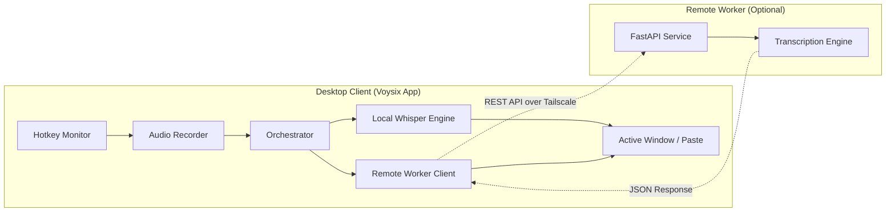
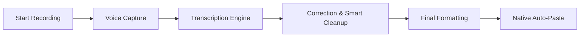

# Voysix — Professional Speech-to-Text for Desktop

[](https://github.com/your-username/voysix/actions)


**Voysix** is an open-source, versatile desktop application that brings the power of **OpenAI's Whisper** (and `faster-whisper`) directly into your daily workflow. Record your ideas, messages, or notes with a single hotkey and have them transcribed and pasted instantly into any application.

---

## ✨ Why Voysix?

- 🚀 **Global Hotkeys**: Control everything from anywhere in Windows with a single click.
- 🎨 **Glassmorphism UI**: A minimalist, high-quality floating interface that stays out of your way.
- 🛠️ **Local or Remote**: Use your own GPU locally OR offload processing to a dedicated worker.
- 💨 **Ultra-Fast**: Optimized for speed with `faster-whisper` and optional worker caching.
- 🔒 **Private**: No third-party APIs required. Your voice data stays on your machine or your private worker nodes.
- 🔗 **Tailscale Native**: Easy, secure remote worker setup with built-in Tailscale discovery.

---

## 🏗️ Architecture & Core Components

Voysix is split into two independent parts, allowing for flexible deployment scenarios:



### 1. Voysix App (`/App`)
Built with **PySide6**, this component handles the recording logic and system-wide integration. It includes features like:
- **Audio Recorder**: Low-latency capture via `sounddevice`.
- **System Tray**: Comprehensive settings management and log viewer.
- **Auto-Paste**: Seamless text insertion into any target app.
- **Smart Cleanup**: Sophisticated punctuation and cleanup logic.

### 2. Voysix Worker (`/worker`)
A high-performance **FastAPI** backend for offloading computations.
- Optimized for **Docker** and **NVIDIA GPUs**.
- Tailscale integration for secure remote access without port forwarding.
- Model caching to avoid reloading overhead.

---

## 🔄 Core Workflow



---

## 🚀 Getting Started

### Installation (Standard User)
If you just want to use Voysix, wait for the first release or follow the build steps below to create your own `.exe`.

### Installation (Developer)

1. **Clone the Repo**:
   ```bash
   git clone https://github.com/your-username/voysix.git
   cd voysix
   ```
2. **Setup Client**:
   ```bash
   cd App
   python -m venv venv
   source venv/Scripts/activate
   pip install -r requirements.txt
   python main.py
   ```
3. **Setup Worker (Optional)**:
   ```bash
   cd worker
   # Option A: Build and run locally
   docker build -t voysix-worker .
   docker run -d --name voysix-worker --restart unless-stopped -e TS_AUTHKEY=<your-key> voysix-worker

   # Option B: Pull from Docker Hub (Simplified)
   # docker pull your-username/voysix-worker:latest
   # docker run -d --name voysix-worker -e TS_AUTHKEY=<your-key> your-username/voysix-worker

#### ⚙️ Worker Environment Variables
The following variables can be passed to the container using `-e KEY=VALUE`:

| Variable | Description | Default |
| :--- | :--- | :--- |
| `TS_AUTHKEY` | **(Required)** Your Tailscale Auth Key to join the private network. | - |
| `API_KEY` | Optional security key for the worker. Must match the "Worker API Key" in the app settings. | - |
| `GPU_ENABLED` | Set to `1` to enable NVIDIA GPU acceleration. | `0` |
| `MODEL_NAME` | Default whisper model to load on startup (tiny, base, small, etc). | `base` |

#### ⚡ GPU Acceleration (Optional)
To enable NVIDIA GPU support in the worker, ensure you have the [NVIDIA Container Toolkit](https://docs.nvidia.com/datacenter/cloud-native/container-toolkit/latest/install-guide.html) installed on your host.

Then, run the container with the `GPU_ENABLED=1` environment variable and the `--gpus all` flag:

```bash
docker run -d --name voysix-worker \
  --restart unless-stopped \
  --gpus all \
  -e TS_AUTHKEY=<your-tailscale-key> \
  -e API_KEY=<your-api-key> \
  -e GPU_ENABLED=1 \
  voysix-worker
```

**Note:** On the first run with `GPU_ENABLED=1`, the worker will detect the missing CUDA dependencies and automatically download **~3GB** of CUDA-enabled PyTorch libraries directly into the container. This only happens once per container lifecycle.
   ```

---

## 🔄 Automated CI/CD

Voysix uses **GitHub Actions** for automated building and quality assurance:
- **`worker-v*`** tags: Automatically builds the Docker image and pushes to both **GitHub Container Registry (GHCR)** and **Docker Hub**.
- **`app-v*`** tags: Automatically compiles the Windows Setup EXE installer and creates a GitHub Release.


---

## 📦 Building Standalone Version

Для сборки Windows-версии (EXE + установщик) используется автоматизированный скрипт:

1. Перейдите в папку приложения: `cd App`
2. Запустите сборку:
   ```bash
   python build_dist.py
   ```

**Что делает этот скрипт:**
- Автоматически увеличивает версию (patch) в `version.txt`, `main.py` и `setup.py`.
- Компилирует Python-код в `.exe` с помощью **cx_Freeze**.
- Собирает финальный инсталлятор через **Inno Setup**.

Результат будет доступен в: `App/dist/Voysix_Setup.exe`.

---

## 📜 Project Structure
- `App/` — All desktop-side files (logic, UI, assets).
- `worker/` — Server-side code for remote processing.
- `.github/workflows/` — Automated build pipelines.
- `LICENSE` — Open source licensing details.

---

## 🤝 Contributing
Contributions are what make the open-source community so amazing. If you have a suggestion that would make this better, please fork the repo and create a pull request.

1. Fork the Project.
2. Create your Feature Branch (`git checkout -b feature/AmazingFeature`).
3. Commit your Changes (`git commit -m 'Add some AmazingFeature'`).
4. Push to the Branch (`git push origin feature/AmazingFeature`).
5. Open a Pull Request.

---

## ⚖️ License
Distributed under the **MIT License**. See `LICENSE` for more information.
